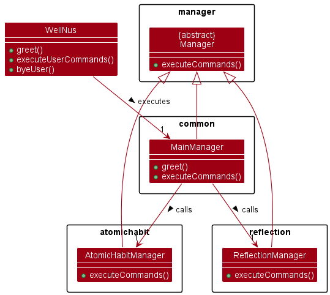

# Developer Guide

## Table of Content

<!-- TOC -->

* [Developer Guide](#developer-guide)
    * [Table of Content](#table-of-content)
    * [Product Name](#product-name)
    * [Acknowledgements](#acknowledgements)
    * [Setting up, getting started](#setting-up-getting-started)
        * [Setting up the project in your computer](#setting-up-the-project-in-your-computer)
        * [Before writing code](#before-writing-code)
    * [Design & implementation](#design--implementation)
        * [Object Diagram](#object-diagram)
    * [Product scope](#product-scope)
        * [Target user profile](#target-user-profile)
        * [Value proposition](#value-proposition)
    * [User Stories](#user-stories)
    * [Non-Functional Requirements](#non-functional-requirements)
    * [Glossary](#glossary)
    * [Instructions for manual testing](#instructions-for-manual-testing)
        * [Launch](#launch)
        * [Sample test cases](#sample-test-cases)
            * [Help command](#help-command)
            * [Get reflection questions](#get-reflection-questions)
            * [Add atomic habits](#add-atomic-habits)
        * [Saving data](#saving-data)

<!-- TOC -->

## Product Name

**WellNUS++**

## Acknowledgements

1. Reference to AB-3 Developer Guide: https://se-education.org/addressbook-level3/DeveloperGuide.html
2. Reference to AB-3 diagrams code: https://github.com/se-edu/addressbook-level3/tree/master/docs/diagrams

## Setting up, getting started

### Setting up the project in your computer

Firstly, **fork** this repo, and **clone** the fork into your computer. <br>
<br>
If you plan to use Intellij IDEA (highly recommended): <br>

1. **Configure the JDK**: Follow the guide
   [[se-edu/guides] IDEA: Configuring the JDK](https://se-education.org/guides/tutorials/intellijJdk.html)
   to ensure Intellij is configured to use **JDK 11**.
2. **Import the project as a Gradle project**: Follow the guide
   [[se-edu/guides] IDEA: Importing a Gradle project](https://se-education.org/guides/tutorials/intellijImportGradleProject.html)
   to import the project into IDEA.<br>
   **Note**: Importing a Gradle project is slightly different from importing a normal Java project.
3. **Verify the setup:**
    1. Run the ```wellnus.WellNus``` and try a few commands.
    2. Run the tests to ensure they all pass.

### Before writing code

1. **Configure the coding style**<br>
   If using IDEA, follow the guide
   [[se-edu/guides] IDEA: Configuring the code style](https://se-education.org/guides/tutorials/intellijCodeStyle.html)
   to set up IDEA’s coding style to match ours.<br>
   <br>
2. **Set up CI**<br>
   This project comes with a GitHub Actions config files (in `.github/workflows` folder).
   When GitHub detects those files, it will run the CI for your project automatically at each push
   to the `master` branch or to any PR. No set up required.<br>
   <br>
3. **Learn the design**<br>
   When you are ready to start coding, we recommend that you look at the class diagrams to understand the structure of
   the
   code and the interaction among different classes.<br>

## Design & implementation
### Reflection Component

This `Reflection` component provides users with random sets of introspective questions for users to reflect on.<br>
<br>
The `reflection` package consists of several classes, namely `ReflectionManager`, `SelfReflection`, `ReflectionQuestion`,
`GetCommand`, `HomeCommand` and `ReflectUi`. There are three abstract classes `Manager`, `Command`, `TextUi` which some 
classes in `reflection` package inherit from. But since these abstract classes are outside of `reflection` package, the 
focus of this section will be on classes inside `reflection` package. <br>
<br>

`ReflectionManager` class:<br>
- This class is in charge of the overall execution of the **Self Reflection** feature. 
- It inherits from abstract class `Manager`
- Each `ReflectionManager` object contains exactly one `ReflectUi` object as an attribute to get user inputs. This is to
use a common `Scanner` object (created in the `ReflectUi` object) to read all the user inputs within Self Reflection feature.
This can avoid potential unexpected behaviours from creating multiple `Scanner` objects. 
- The `runEventDriver()` method is the entry of the Self Reflection feature, the caller creates a `ReflectionManager` 
object and calls this method to launch the Self Reflection feature. It calls a class-level method `SelfReflection.greet()`
to print greeting logo and message, therefore, `SelfReflection` class is a dependency of `ReflectionManager` class. 
- It contains a **while loop** to continuously get user input commands as users are expected to continuously perform a series of actions
within Self Reflection feature until they wish to return back to main WellNUS++ interface(input `home` command). 
- The termination condition of the while loop is controlled by a static attribute `isExit`. Whenever `runEventDriver()`
method is called, the `isExit` attribute will be initialised as `false`. This attribute can be accessed by other objects
(more specifically `HomeCommand` object) through a static method `setIsExit()` to set to `true` and the while loop will 
be terminated. The `static` attribute allows other objects to modify `isExit` value. 
- Upon getting input commands, the `runEventDriver()` method will call the `executeCommands()` method. Based on the 
input command type, the `executeCommands()` method will then create the correct type of command object and call `.execute()`
method to execute the command accordingly.  
- Each `ReflectionManager` object will contain `1..*` `HomeCommand` and `GetCommand` objects since a list of supported commands 
will be set up upon the instantiation of `ReflectionManager` object. 

`ReflectionQuestion` class:<br>
- Each introspective question is a `ReflectionQuestion` object. 
- It contains the basic description of the introspective question. Being modelled as an object instead of pure string, each
question will be able to have more attributes such as like which will be utilized in future features.

`SelfReflection` class:<br>
- This class contains the information about the Self Reflection feature (e.g. greeting message, logo).
- It contains a `String` array of 10 introspective questions. Upon the instantiation of a `SelfReflection` object, 
`setUpQuestions()` method will be called in the constructor, these questions will be used to create an `arrayList` of 
10 `ReflectionQuestion` objects. 
- By abstracting the above-mentioned attributes and methods as a separate class instead of putting them in `ReflectionManager`,
the `ReflectionManager` class can solely focus command execution. As the greeting message and introspective are subject to changes
in the future, it will be beneficial to have a separate class taking care of these data. 

`GetCommand` class:<br>
- This command allows users to get a list of 5 random introspective questions.
- Upon calling the `.execute()` method of a `GetCommand` object, the `validateCommand()` method will first be called to
validate the commands. If the commands are invalid, a `BadCommandException` will be thrown.
- The `generateRandomQuestions()` method will be called and within which a `SelfReflection` object will be instantiated.
The `generateRandomNumbers()` method is called to generate a set of 5 distinct integers(0 ~ num_of_questions-1), this set
of integers will be used as indexes to select the corresponding questions from the pool of 10 questions available in the
`SelfReflection` object. 
- Since `SelfReflection` object is only created when `getRandomQuestions()` method is called, there might be a `GetCommand`
object without `SelfReflection` objects. Every time the `getRandomQuestions()` method is called, a new `SelfReflection` object 
is created, hence, the multiplicity from `GetCommand` class to `SelfReflection` class is `*` (i.e. 0 or more). 

`HomeCommand` class: <br>
- This command allows users to return back to the main WellNUS++ interface. 
- Similar to `GetCommand`, `validateCommand()` method will also be called to validate the command. 
- It will then call the class-level method `ReflectionManager.setIsExit()` to terminate the while loop
in `ReflectionManager` object. 

`ReflectUi` class: <br>
- It inherits from `TextUi` class and is in charge of printing output to users.
- This subclass is created to allow Self Reflection feature to have more customised output behaviour(e.g. type of separators)
other than those inherited from parent class `TextUi`. 

### CommandParser Component

The CommandParser is a core feature of WellNUS++.
It defines the following:

1. The syntax for users to input commands
2. A common API for developers to **process** user input

#### Design Considerations

The CommandParser is implicitly used by users 100% of the time.
It is the abstraction through which the users will interact with WellNUS++'s features.
Its ease of use is critical to ensure a good user experience.

**User design Considerations**:  
Our [target user profile](#target-user-profile) are Computing and Engineering students.
With that, we have done extensive research and laid out the following design considerations.

1. **Easy learning curve**  
   Our users are often strapped for time and tend to prefer to use tools that
   they are familiar with or can learn quickly. Our command syntax should be easy
   to remember, predictable and intuitive.
2. **Flexible usage**  
   "Arguments" for a command should not care about the order of arguments.
   Users often type what comes to mind first. Allowing flexible order of arguments
   reduces the cognitive load on the user's end and allows for a
   more pleasant experience.

**Developer Design Considerations**:  
Virtually every feature in WellNUS++ will require user input to be processed. This means that all features
will have to interact with `CommandParser`. Hence, the
design for the `CommandParser` API must be understandable, unambiguous and easy to develop on.

3. **Easy way to extract components of user input**  
   Each component of userInput (arguments, payload, etc) should be obtainable in predictable and non-arbitrary way.
   Arbitrary way (using index) is not preferred as it is prone to developer erros.
4. **Easy way to validate user input**  
   There should also be built-in ways to easily validate components of user input for a command,
   such as checking length.

#### CommandParser Syntax

The command parser defines any arbitrary user input to be valid
if it follows the following structure.

```
mainCommand [payload] [--argument1 [payload1] --argument2 [payload2] ... ]
```

This should be familiar to you. It is similar to how most CLI applications process arguments in the wild.


<figcaption align="center">Example of CLI input syntax in the wild</figcaption>

This achieves design consideration (1). Why?  
This syntax is intuitive at a glance to our target users,
is predictable and easy to remember as the only thing they need to remember is the argument name and
the '--' delimiter.

From this syntax, we can generalise ALL user inputs as `(argument, payload)` pairs.  
`mainCommand` is a special `argument`, where it MUST be the first word in the user input.

Due to the unique one-to-one relationship between arguments and payloads, we can model a user input
using this syntax using a `HashMap` mapping each `argument` to a `payload`.

For example,
`
$ foo bar --arg1 payload1 payload1--1 --arg2 payload2 --arg3
`

Will be mapped as:
`
(foo, bar), (arg1 payload1 payload1--1), (arg2 payload2), (arg3, "")
`
where `""` represents an empty string (for visualization).

Using a `HashMap` fulfils design considerations (2), (3) and (4).

- (2): Order of arguments do not matter as
- (3): To get a `payload`, the developer simply needs to call `myHashMap.get("argument")`.  
  This syntatic sugar prevents developer errors compared to an index-based approach.
- (4): Validating commands is much less difficult using `HashMap`. For example, size can be checked with
  built-in `.size()`,
  argument existence can be queried with `.containsKey()`.

#### Integration with WellNUS++


`CommandParser` integrates into the boilerplate via the abstract Manager class.  
All features are controlled by a manager subclass - hence the developers just need to call
`getCommandParser` to get a reference to the `CommandParser` taking care of all commands
in the `Manager` subclass.

#### CommandParser API

There are only two methods that developers need to know to use `CommandParser`.

1. `parseUserInput`
2. `getMainArgument`

**Usage: `parseUserInput`**

`parseUserInput` is used to get a `HashMap` representation of the user input, a bijection
between `argument` and `payload` pairs.

Implementation of `parseUserInput`:


`parseUserInput(String userInput)` is used to directly convert a string into their argument-payload pairs.
It first calls `splitIntoCommand` to split input over the `' --'` delimiter to get a `String[] commands`.
Each `command` in `commands[]` contain the argument and payload. Internally, it splits the
argument from the payload and populates a `HashMap` with the one-to-one mapping. After all `command`s have
been processed, the map is returned to the `Manager` for usage.

**Sample Code**

```java
// Example usage to get the HashMap
public class FooManager extends Manager {
    public HashMap<String, String> handleCommand(String userInput) {
        // Get a reference to the parser
        CommandParser parser = getCommandParser();
        // Get the one-to-one mapping
        HashMap<String, String> result = parseUserInput(userInput);
        return result;
    }
}
```

**Usage: `getMainCommand(userInput)`**

To understand what the user wants to do, we need a convenient way to get the `mainCommand` from the user input.
The canonical way to do this is to use `getMainCommand`. This defeats adversarial input where the main command
is input as an argument.

Internally, this just splits the string by whitespace and returns the first word in the array.

#### Alternative Designs Considered

We considered alternative command structures such as [AB3](https://se-education.org/addressbook-level3/UserGuide.html)
where input types are
specified , `e.g. n/John Doe` which more 'secure' from the get go.
However, due to the following issues, AB3 was not chosen as the alternative solution compared to the shell-like
structure.

**Steep learning curve**  
For experienced and inexperienced users, it is a hassle to remember what letter corresponds to what argument.
For AB3, the user needs to remember all the different `char` 'verbs' such as `e/` for email, `n/` for name.
This violates design consideration (1).

**Does not scale well**  
AB3 structure runs the high risk of argument-space collision as well.  
For example, consider a command that needs an "email" and "entry". What does `e/<payload>` correspond to?
We could simply just put entry as *some other character* -- but that defeats the purpose of having the structure in the
first place as the character is the argument's first character.
This makes behaviour **unpredictable** and a **confusing** user experience.

**Bad expert user experience**

For expert users and CLI-masters, pedantic argument input like AB3 makes the typing experience MUCH slower due to the
need to type which is relatively clunky as the user will need to type far off to the '/' key on the keyboard.

### AtomicHabit Component


The `AtomicHabit` component is responsible for tracking the user's daily habits.
It consists of the `feature` package and the `command` package.

The `command` package consists of the `AddCommand`, `HomeCommand`, `ListCommand`, `UpdateCommand`.

* `AddCommand` - Adds a new habit to the user's habit list.
* `HomeCommand` - Returns the user back to main interface.
* `ListCommand` - Lists all the user's habits.
* `UpdateCommand` - Updates the user's habit count.

The `feature` package contains the `AtomicHabit` class, the `AtomicHabitList` class and the `AtomicHabitManager` class.
The `AtomicHabit` class represents a single habit, while the `AtomicHabitList` class represents the list of all the
user's habit and the `AtomicHabitManager` class is the class that manages the `AtomicHabitList` class and executes
the `commands`.

The `AtomicHabitManager` class utilises `TextUi` class to process user inputs and execute the `commands` accordingly.

The `AtomicHabitList` class is implemented as an ArrayList of `AtomicHabit` objects.

The `AtomicHabit` class has the following attributes:

* `description` - the description of the habit
* `count` - the number of times the habit is done

### Managers
<br/>
The `Manager` abstract class is the superclass for classes responsible for handling user interaction with the app.

Each `Manager` provides `runEventDriver()`, which takes over control of user interaction and provides a particular
feature(along with all its commands). This fulfils the `Single Responsibility Principle` as every `Manager` is in charge
of one particular feature and recognises its feature's commands, so it will only change when the feature
and/or its commands change. This reduces coupling and increases cohesion as changes in one feature will not
cascade and require amendments to other code(e.g. other `Manager`s), and one feature's commands and input are processed
together in one class(a particular implementation of `Manager`). This design further fulfils the `Dependency Inversion
Principle` as the main `WellNus` class doesn't depend on actual implementations of `Manager`, but on the abstract
`Manager` class and its `runEventDriver()` method that all implementations of `Manager` shall provide(with the same
expected functionality). Individual `Manager`s are free to provide additional functionality, but `WellNus` shall not
expect any or depend on them so changes in individual features will not require updating the main `WellNus` class.

In `runEventDriver()`, every `Manager` shall read and process user input using `TextUi` and `CommandParser` and delegate
the issued command to the corresponding `Command` class. This fulfils the `Single Responsibility Principle`, as a
particular implementation of `Manager` is not responsible for providing logic to read user input from the commandline,
nor provide logic for any of the feature's supported commands. Its responsibility is abstract and singular: to recognise
supported commands and call the corresponding `Command` implementation to execute the user's
requested action. This ensures that changes in logic for individual commands or reading of user input will not require
any changes in a particular implementation of `Manager`, as should be expected. A `Manager` class will only change to
recognise new commands for its feature.

`MainManager` is a unique implementation of `Manager` in that it holds references to every feature's `Manager` instance.
This is important as `MainManager` then acts as an abstraction barrier for the application: `WellNus` does not know
what features or commands are supported by the application, and only knows that `MainManager` can recognise supported
features and commands within its `runEventDriver()` implementation. As such, the main `WellNus` class can be kept
abstract and simple: call `MainManager.runEventDriver()` to handle user interaction and greet the user. Additionally,
holding references to every feature's `Manager` allows `MainManager` to preserve the entire state of the running
application so that a previous session for a feature can be fully restored when the user returns to it, as though
he/she never left. This makes sense conceptually for a class named `MainManager` and eliminates the need to restore a
particular `Manager`'s state from storage if the application is still running and the user returns to a particular
feature.

## Product scope

### Target user profile

* NUS Computing and Engineering students
* Spend lots of time coding on their IDE and type relatively fast
* Have to regularly use digital gadgets and Internet for their courses
* Very familiar with command line interfaces
* Stressed about academy and many others
* Busy with work and drowning in deadlines
* Wants to improve their wellness
* Sometimes unmotivated with short attention span

### Value proposition

NUS Computing and Engineering students are often busy with work and sometimes will neglect their wellness. This app aims
to help NUS Computing and Engineering students improve their overall wellness by encouraging the **cultivation of
meaningful
atomic habits**, **practice of self reflection** and **usage of offline timer to stay focused**. By using this app,
we hope users will be more aware of the healthiness of their daily life and take actions to improve their wellness.<br>
<br>
WellNUS++ is a CLI app, primarily due to the following reasons:

* Computing students generally type fast and prefer typing to mouse due to their daily coding routines.
* Due to the data heavy nature and personalised user input of this app, typing will be preferred to clicking.
* In particular, our application is built to reduce context switching. Users can launch the application from the comfort
  of their favourite IDE’s terminal to reduce disruption to their daily coding lives.
* Instead of using electronics with fancy GUI, this CLI app gives computing students an opportunity to minimise digital
  interaction which will be beneficial for their wellness.
* The app is gamified to make it more attractive for students to use. Levels and micro-goals incentivise our
  users to keep using the app’s features, allowing them to focus on their work and achieve wellness.

## User Stories

| Version | As a ...                                           | I want to ...                                               | So that I can ...                                  |
|---------|----------------------------------------------------|-------------------------------------------------------------|----------------------------------------------------|
| v1.0    | Computing student who prefers typing over clicking | I can use keyboard instead of mouse                         | I can use the app efficiently                      |
| v1.0    | Computing student who is too used to the Internet  | Reduce my browsing and information overload                 | I can improve my attention span                    |
| v1.0    | Reflective student                                 | I can get one introspective question on-demand              | I can reflect and grow emotionally at my own pace  |
| v1.0    | Computing student who wishes to improve lifestyle  | I can add an atomic habit to track                          | I can start the process of inculcating a new habit |
| v1.0    | Computing student who wishes to improve lifestyle  | I can view all my atomic habits                             | I can keep track of my self-improvement progress   |
| v1.0    | Computing student who wishes to improve lifestyle  | I can update my atomic habits                               | I can adjust the habits based on my progress       |
| v2.0    | Reflective student                                 | I can mark introspective questions that I resonate with     | I can reflect using my favourite questions         |
| v2.0    | Reflective student                                 | I can get the previous questions I viewed                   | I can re-view these questions                      |
| v2.0    | Easily distracted computing student                | I want to start a timer to keep track of time spent on work | I can do timed-practice                            |
| v2.0    | Easily distracted computing student                | I want to check the time                                    | I can keep track of my pace                        |
| v2.0    | A regular WellNUS++ user                           | I wish to have my information stored in the app             | I can re-view my past data                         |

## Non-Functional Requirements

1. Should work on any mainstream OS as long as it has Java 11 or above installed.
2. A user with above average typing speed for regular English text (i.e. not code, not system admin commands) should
   be able to accomplish most of the tasks faster using commands than using the mouse.

## Glossary

* *glossary item* - Definition
* **Mainstream OS**: Windows, Linux, Unix, OS-X
* **Main Command**: The first WORD that a user types in. `e.g. reflect, exit`
* **Argument**: A word that is a parameter to a `Main Command` and is prefixed by ` --`. `e.g. --id, --name`
* **Payload**: An (optional) arbitrary sequence of characters immediately following a main command or argument.
  The payload will terminate when the user clicks `enter` or separates the payload with another argument
  with the `--` delimiter.

## Instructions for manual testing

### Launch

1. Ensure you have Java 11 or above installed in your Computer.
2. Download the latest `wellnus.jar` from here.
3. Copy the file to the folder you want to use as the home folder for your WellNUS++.
4. Open a command terminal, cd into the folder you put the `wellnus.jar` file in, and use the `java -jar wellnus.jar`
   command to run the application. A CLI should appear in a few seconds.

### Sample test cases

#### Help command

1. Make sure you are in the main interface, but individual features(i.e. hb, reflect and timer)
2. Test case: `help`<br>
   Expected output: a list of commands with their usage
   Example:

```
------------------------------------------------------------
    We are here to ensure your wellness is taken care of through WellNUS++
Here are all the commands available for you!
------------------------------------------------------------
------------------------------------------------------------
    1. hb - Enter Atomic Habits: Track your small daily habits and nurture it to form a larger behaviour
    usage: hb
    2. reflect - Read through introspective questions for your reflection
    usage: reflect
    3. exit - Exit WellNUS++
    usage: exit
------------------------------------------------------------
```

3. Test case: `help me`<br>
   Expected output: the list of commands will not be generated as it is an invalid command<br>
   Example:

```
------------------------------------------------------------
    help does not take in any arguments!
------------------------------------------------------------
```

4. To get a list of available commands, any command other than `help` is invalid

#### Get reflection questions

1. Make sure you are inside **Self Reflection** feature by enter `reflect` command after the launch of the program
2. Test case: `get`<br>
   Expected output: get a set of 5 random introspective questions<br>
   Example:

```
============================================================
    1.What is my purpose in life?
    2.What is my personality type?
    3.Did I make time for myself this week?
    4.What scares me the most right now?
    5.When is the last time I gave back to others?
============================================================
```

3. Test case: `get reflect`<br>
   Expected output: introspective questions will not be generated as this is an invalid command. <br>
   Example:

```
!!!!!!-------!!!!!--------!!!!!!!------!!!!!---------!!!!!!!
Error Message:
    Command is invalid.
Note:
    Please check the available commands and the format of commands.
!!!!!!-------!!!!!--------!!!!!!!------!!!!!---------!!!!!!!
```

4. Any command other than `get` is invalid

#### Add atomic habits

1. Make sure you are inside **Atomic habit** feature by enter `hb` command after the launch of the program
2. Test case: `add --name make bed every morning`<br>
   Expected output: a new atomic habit is successfully added<br>
   Example:

```
------------------------------------------------------------
    Yay! You have added a new habit:
    'make bed every morning' was successfully added
------------------------------------------------------------
```

3. Test case: `add name make bed every morning`<br>
   Expected output: the atomic habit will not be added in as this is an invalid command<br>
   Example:

```
!!!!!!-------!!!!!--------!!!!!!!------!!!!!---------!!!!!!!
Error Message:
    Wrong arguments given to 'add'!
Note:
    
!!!!!!-------!!!!!--------!!!!!!!------!!!!!---------!!!!!!!
```

4. Any commands that does not follow the format of `add --name ATOMIC_HABIT_NAME` is invalid

### Saving data
To be implemented. 