# Developer Guide

# Table of Contents

<!-- TOC -->
* [Developer Guide](#developer-guide)
* [Table of Contents](#table-of-contents)
* [Product Name](#product-name)
* [Acknowledgements](#acknowledgements)
* [Setting up, getting started](#setting-up-getting-started)
  * [Setting up the project in your computer](#setting-up-the-project-in-your-computer)
  * [Before writing code](#before-writing-code)
* [Design & implementation](#design--implementation)
  * [Application Lifecycle](#application-lifecycle)
    * [Overview](#overview)
    * [Rationale](#rationale)
  * [UI Component](#ui-component)
    * [UI Implementation](#ui-implementation)
  * [Self Reflection Component](#self-reflection-component)
    * [Design considerations](#design-considerations)
      * [User design considerations](#user-design-considerations)
      * [Developer design considerations](#developer-design-considerations)
    * [Self Reflection Implementation](#self-reflection-implementation)
      * [Self Reflection commands implementation](#self-reflection-commands-implementation)
  * [CommandParser Component](#commandparser-component)
    * [Design Considerations](#design-considerations-1)
      * [User design Considerations](#user-design-considerations-1)
      * [Developer Design Considerations](#developer-design-considerations-1)
      * [Alternative Designs Considered](#alternative-designs-considered)
    * [CommandParser Syntax](#commandparser-syntax)
    * [Implementation](#implementation)
      * [Integration with WellNUS++](#integration-with-wellnus)
      * [CommandParser API](#commandparser-api)
  * [AtomicHabit Component](#atomichabit-component)
    * [Package Layout](#package-layout)
    * [Implementation of `AtomicHabitManager`](#implementation-of-atomichabitmanager)
  * [Managers](#managers)
    * [Implementation Rationale](#implementation-rationale)
    * [`MainManager`: A Unique Implementation](#mainmanager--a-unique-implementation)
  * [Tokenizer](#tokenizer)
    * [Implementation Rationale](#implementation-rationale-1)
    * [Individual Tokenizers](#individual-tokenizers)
  * [Storage](#storage)
    * [Usage: `saveData()`](#usage--savedata)
    * [Design Considerations](#design-considerations-2)
  * [Focus Timer Component](#focus-timer-component)
    * [Design Considerations](#design-considerations-3)
    * [Focus Timer Implementation](#focus-timer-implementation)
      * [State Management](#state-management)
      * [Commands](#commands)
  * [Product scope](#product-scope)
    * [Target user profile](#target-user-profile)
    * [Value proposition](#value-proposition)
  * [User Stories](#user-stories)
  * [Non-Functional Requirements](#non-functional-requirements)
  * [Glossary](#glossary)
  * [Instructions for manual testing](#instructions-for-manual-testing)
    * [Launch](#launch)
    * [Sample test cases](#sample-test-cases)
      * [Help command](#help-command)
      * [Get reflection questions](#get-reflection-questions)
      * [Add atomic habits](#add-atomic-habits)
    * [Saving data](#saving-data)
<!-- TOC -->

# Product Name

**WellNUS++**

# Acknowledgements

1. Reference to AB-3 Developer Guide: https://se-education.org/addressbook-level3/DeveloperGuide.html
2. Reference to AB-3 diagrams code: https://github.com/se-edu/addressbook-level3/tree/master/docs/diagrams

# Setting up, getting started

## Setting up the project in your computer

Firstly, **fork** this repo, and **clone** the fork into your computer. <br>
<br>
If you plan to use Intellij IDEA (highly recommended): <br>

1. **Configure the JDK**: Follow the guide
   [[se-edu/guides] IDEA: Configuring the JDK](https://se-education.org/guides/tutorials/intellijJdk.html)
   to ensure Intellij is configured to use **JDK 11**.
2. **Import the project as a Gradle project**: Follow the guide
   [[se-edu/guides] IDEA: Importing a Gradle project](https://se-education.org/guides/tutorials/intellijImportGradleProject.html)
   to import the project into IDEA.<br>
   **Note**: Importing a Gradle project is slightly different from importing a normal Java project.
3. **Verify the setup:**
    1. Run the ```wellnus.WellNus``` and try a few commands.
    2. Run the tests to ensure they all pass.

## Before writing code

1. **Configure the coding style**<br>
   If using IDEA, follow the guide
   [[se-edu/guides] IDEA: Configuring the code style](https://se-education.org/guides/tutorials/intellijCodeStyle.html)
   to set up IDEA’s coding style to match ours.<br>
   <br>
2. **Set up CI**<br>
   This project comes with a GitHub Actions config files (in `.github/workflows` folder).
   When GitHub detects those files, it will run the CI for your project automatically at each push
   to the `master` branch or to any PR. No set up required.<br>
   <br>
3. **Learn the design**<br>
   When you are ready to start coding, we recommend that you look at the class diagrams to understand the structure of
   the
   code and the interaction among different classes.<br>

# Design & implementation
<!-- @@author haoyangw -->
## Application Lifecycle
### Overview
The overall execution lifecycle of the WellNus application involves 4 main components, as shown in the diagram below.

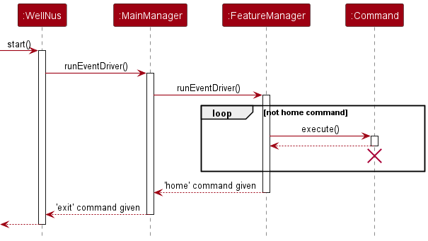

The application begins with a call to `WellNus.start()`, which initialises an instance of `MainManager` and calls the 
`MainManager.runEventDriver()` method.

`MainManager.runEventDriver()` will then take control of user input and provide a basic interface that parses commands 
from the user. This basic interface only supports basic commands such as `help` and `exit` and recognises the keywords
of all supported features in WellNUS++. When a recognised feature keyword is given, the corresponding `FeatureManager` 
will be activated through its `runEventDriver()` method, which gains control of user input from `MainManager`. On the
other hand, `MainManager.runEventDriver()` terminates when the `exit` command is given, after which the user exits from
the application.

After control of user input is granted by `MainManager`, `FeatureManager.runEventDriver()` provides the user with a
feature-specific user interface that continuously parses user commands to determine the suitable `Command` class to 
handle any given command. In the case of supported commands besides 'home', the `execute()` method of the corresponding 
`Command` class is called to perform a particular action requested by the user. On the other hand, the `home` command 
will terminate the `FeatureManager.runEventDriver()` loop, returning the user to the main WellNus++ interface provided 
by `MainManager.runEventDriver()`.

### Rationale
`WellNus` directly transfers control of user input to `MainManager.runEventDriver()` as managing user input is the
expected functionality of the `runEventDriver()` method within a particular implementation of `Manager`, which means
that conceptually, management of user input belongs in a subclass of `Manager` instead. Besides, this abstraction
of user input logic from `WellNus` fulfils the `Single Responsibility Principle` since `WellNus` is intended
to be a high-level class that delegates tasks to specialised classes that provide the expected functionality, and thus
`WellNus` must not be responsible for concrete logic such as managing user input.

Additionally, `MainManager.runEventDriver()` is intentionally restricted to only recognise basic commands and feature
keywords to firstly, achieve the encapsulation and abstraction of feature-specific logic from `MainManager`. Moving 
feature-specific logic such as recognising feature-specific commands to corresponding feature `Managers` ensures that
actual implementation details in feature-related subpackages are hidden from `MainManager`. This is necessary for 
the purpose of encapsulation since `MainManager` exists in a different subpackage. At the same time, by providing the
public `runEventDriver()` in feature `Managers`, `MainManager` is only aware of the expected functionality of the
`runEventDriver()`, which can be used to support feature-specific commands, without being involved in the implementation
details. This allows `MainManager.runEventDriver()` to be kept abstract while providing the expected functionality of
the application. Secondly, this design fulfils the `Single Responsibility Principle` as `MainManager` is solely
responsible for the main WellNUS++ commands but not any feature-specific ones, which means that its logic will only
be changed for reasons related to the main WellNUS++ commands only.

Lastly, the `runEventDriver()` method of feature `Managers` delegates the execution of commands to implementations of
`Command` to abide by the `Single Responsibility Principle`. Every `Manager.runEventDriver()` method is expected to
provide a particular user interface, but not any commands. This means that this method should only change for reasons
related to its user interface, which requires that command handling logic be implemented elsewhere so that changes in
commands do not require changes in any implementation of `Manager.runEventDriver()`. Besides, this approach ensures
abstraction of logic as `Manager.runEventDriver()` ensures that command handling is performed while avoiding the
actual implementation details by delegating the task to a particular implementation of `Command.execute()`, which is
known to provide command handling functionality.
<!-- @@author -->

<!-- @@author wenxin-c -->
## UI Component
UI component is in charge of reading in user input and printing output.

### UI Implementation

The `TextUi` superclass is created for printing standard output and error messages. Each feature has its own UI subclass which 
inherits from `TextUi` to support more customised I/O behaviours.<br>
Main WellNUS++ uses TextUi<br>
Atomic Habit uses AtomicHabitUi<br>
Self Reflection uses ReflectUi<br>
Focus Timer uses FocusUi<br>
Gamification uses GamificationUi<br>
For example, the line separator for Self Reflection is `=` and for Atomic Habit is `~`.
<!-- @@author -->

<!-- @@author wenxin-c -->
## Self Reflection Component
This `Reflection` component provides users with random sets of introspective questions to reflect on, achieving the goal
of improving their wellness.<br>

### Design considerations
#### User design considerations
* The sets of questions generated everytime are designed to be randomised to allow users to reflect on different aspects
of their lives.
* Users can review the previous set of questions generated and add questions they resonate well into their favorite list 
for review in the future. Similarly, they can also remove questions they no longer resonate from their favorite list to 
ensure the relevancy of the list.
* `help` command and prompting messages are available to guide users in using Self Reflection. For example, an alert will
be given to users if they `unlike` a question when their favorite list is empty.
```
============================================================
    The favorite list is empty, there is nothing to be removed.
============================================================
```
* A unique line separator `=` is used to differentiate Self Reflection from other features and give users a better visual
indication.
#### Developer design considerations
* **Abstracted `QuestionList` Class**<br>
  Self Reflection section relies heavily on the set of random sets of questions generated and this set will be shared 
  across different classes. A `QuestionList` class is used to store and manipulate the lists of questions such as the 
  random sets and the favorite list. A common `QuestionList` object is constructed and passed into different command object
  constructors as an argument. As such, information of lists of questions and their associated methods are centralised 
  and shared among different objects.
* **Generate random sets and match user input index to real question index**<br>
  Multiple data structures are used randomise the sets of questions. An **ArrayList** of 10 questions
  will be loaded upon launching the program. A **Set** of 5 randomised distinct integers ranging from 0-9 will be generated.
  This **Set** of integers are the used as the index of questions in the **ArrayList** to select the corresponding questions
  and stored for other usages (e.g. `like`, `unlike` commands).
  The displayed index of questions increments from 1 to 5, which might differ from their real indexes in the ArrayList. 
  A **HashMap** is then used with displayed index being the key and real question index being the value to ensure that the correct
  question will be mapped to from user input index (i.e. displayed index).
* **User input validation**<br>
  Checking mechanism is used to validate user input. The first validation happens at manager level and the `CommandKeyword` will be checked.
  A correct type of command object will be created based on `CommandKeyword`. The second validation happens at command level
  to validate arguments and payloads. This is done at command level instead of manager level as different commands might have 
  different requirements for the inputs.

### Self Reflection Implementation
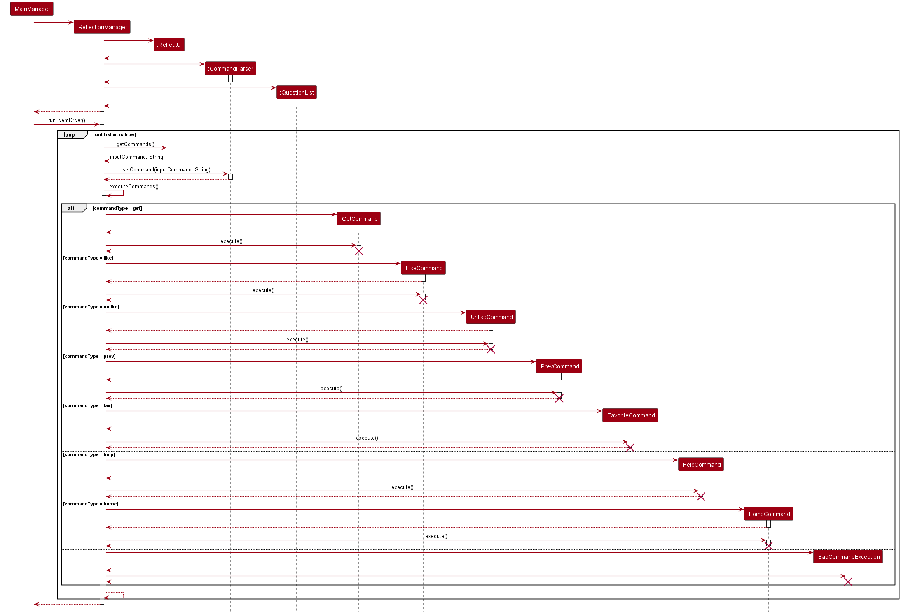
A `ReflectionManager` object is created by the WellNUS++ `MainManager`. It uses a `ReflectUi` and `CommandParser` object 
to constantly reads in and interprets user input and create the correct command for execution based on input 
command type until a `HomeCommand`. A common `QuestionList`object is shared among command objects to retrieve and modify user data. 


`ReflectionManager` class:<br>
- The main event driver of **Self Reflection** feature.
- It inherits from abstract `Manager` class to standardise behaviours. For example. `ReflectionManager` needs to override a 
  standardised abstract method `runEventDriver()` as that this method can be better invoked by the `MainManager`.
- Each `ReflectionManager` object contains exactly one `ReflectUi` object as an attribute to constantly get user inputs. This is to
  use a common `Scanner` object (created in the `ReflectUi` object) to read all the user inputs within Self Reflection
  feature. This can avoid potential unexpected behaviours from creating multiple `Scanner` objects.
- The `runEventDriver()` method is the entry of the Self Reflection feature. It contains a **while loop** to
  continuously get user input commands as users are expected to continuously perform a series of actions within Self Reflection
  feature until they wish to return back to main WellNUS++ interface(input `home` command).
- Based on the input command type, the `executeCommands()` method will create the correct command objects and
  invoke the execution of these commands. Since the command objects are local variables, they are dependencies for `ReflectionManager` class.

`QuestionList` class:<br>
- This class stores the list of 10 `ReflectionQuestion` objects available in Self Reflection. It is in charge of retrieving and modifying
  user data related to `ReflectionQuestion` such as the favorite list and the indexes of the previously generated set of questions.
- A `ReflectionManager` object has exactly one `QuestionList` object which is then passed by reference to construct command
  objects(`LikeCommand`, `GetCommand` etc). Hence, it is a dependency for all command objects in Self Reflection. This structure
  allows data to be centralised and well organised by one class.
- By abstracting the above-mentioned attributes and methods as a separate class instead of putting them
  in `ReflectionManager`, the `ReflectionManager` class can solely focus command execution. All the data related to the 
  list of questions is taken care of by the `QuestionList` class. As such, Single responsibility can be better achieved.
- A `QuestionList` object has exactly one `Storage` and `ReflectionTokenizer` class to store data into data file upon update
  and load data from data file upon launching WellNUS++.

`ReflectionQuestion` class:<br>
- Each introspective question is a `ReflectionQuestion` object.
- It contains the basic description of the introspective question. Being modelled as an object instead of pure string,
  each question will be able to have more attributes which might be utilized for future features.

`ReflectUi` class: <br>
- This subclass inherits from `TextUi` superclass. It allows Self Reflection feature to have more customised output 
  behaviour(e.g. type of separators).

`ReflectionCommands` class: <br>
- This represents a collection of all commands in Self Reflection feature, which will be explained in more detail at later section.
- Each command class inherits from `Command` abstract class and override `validateComand()` abstract method to validate
  command. 
- Commands available in Self Reflection: <br>
  Get a random set of reflection questions: `get`<br>
  Add a particular question into favorite list: `like INDEX`<br>
  Remove a particular question from favorite list: `unlike INDEX`<br>
  View questions in the favorite list: `fav`<br>
  Review the previous set of questions: `prev`<br>
  Help command: `help`<br>
  Return back to main WellNUS++: `home`

#### Self Reflection commands implementation
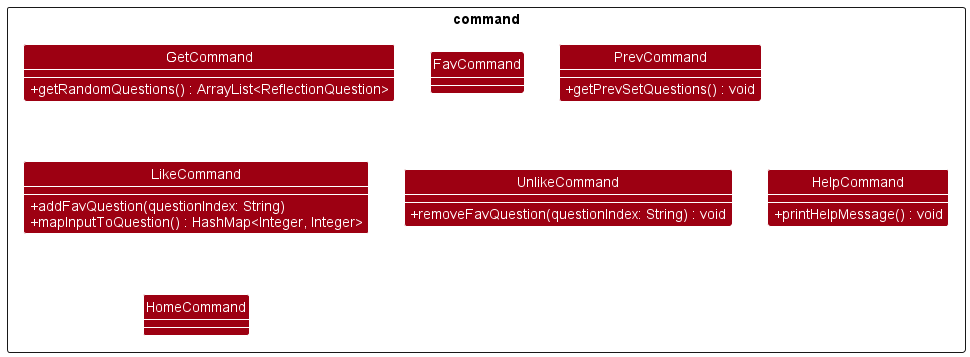

`GetCommand` class: <br>
- Command format: `get`
- This command generates a set of 5 random introspective questions for users to reflect on.
- A `QuestionList` object is passed in as a dependency to provide the pool of 10 introspective questions available 
and generate the set of indexes.

`LikeCommand` class: <br>
- Command format: `like INDEX`
- Users can add reflection question that is generated in the previous set into their favorite list. As there
  will only be 5 questions per random set, the indexes are restricted to integer 1~5.
- The `QuestionList` class is used to as a dependency and `addFavQuestion()` method in called to add and store the data.
- Every time a question is added into the favorite list, the indexes of this particular question will be stored in data
  file straightaway. It prevents data loss due to unforeseen computer shutdown.
- Users can only successfully add a question to favorite list if they have gotten **at least** one set of questions previously.

`UnlikeCommand` class: <br>
- Command format: `unlike INDEX`
- Users can remove reflection questions from their favorite list. 
- The `removeFavQuestion()` method in `QuestionList` class is used to remove data and the mechanism is similar to `like` command.

`FavoriteCommand` class: <br>
- Command format: `fav`
- Users can review the questions in their favorite list.
- The `getFavQuestions()` method in `QuestionList` class is called to retrieve the questions based on the indexes in the 
favorite list.

`PrevCommand` class: <br>
- Command format: `prev`
- Users can review the set of questions generated by the previous `get` command. It only works if users have gotten
  **at least** one set of questions.

`HelpCommand` class: <br>
- Command format: `help [COMMAND_TO_CHECK]`
- Every command class has public attributes `COMMAND_DESCRIPTION` and `COMMAND_USAGE`.
- `printHelpMessage()` method in `HelpCommand` will retrieve and print these attributes.

`HomeCommand` class: <br>
- Command format: `home`
- This command allows users to return back to the main WellNUS++ interface.

<!-- @@author -->

<!-- @@author nichyjt -->
## CommandParser Component

The CommandParser is a core feature of WellNUS++.
It defines the following:

1. The syntax for users to input commands
2. A common API for developers to **process** user input

### Design Considerations

The CommandParser is implicitly used by users 100% of the time.
It is the abstraction through which the users will interact with WellNUS++'s features.
Its ease of use is critical to ensure a good user experience.

#### User design Considerations    
Our [target user profile](#target-user-profile) are Computing and Engineering students.
With that, we have done extensive research and laid out the following design considerations.

1. **Easy learning curve**  
   Our users are often strapped for time and tend to prefer to use tools that
   they are familiar with or can learn quickly. Our command syntax should be easy
   to remember, predictable and intuitive.
2. **Flexible usage**  
   "Arguments" for a command should not care about the order of arguments.
   Users often type what comes to mind first. Allowing flexible order of arguments
   reduces the cognitive load on the user's end and allows for a
   more pleasant experience.

#### Developer Design Considerations  
Virtually every feature in WellNUS++ will require user input to be processed. This means that all features
will have to interact with `CommandParser`. Hence, the
design for the `CommandParser` API must be understandable, unambiguous and easy to develop on.

3. **Easy way to extract components of user input**  
   Each component of userInput (arguments, payload, etc) should be obtainable in predictable and non-arbitrary way.
   Arbitrary way (using index) is not preferred as it is prone to developer erros.
4. **Easy way to validate user input**  
   There should also be built-in ways to easily validate components of user input for a command,
   such as checking length.

#### Alternative Designs Considered

We considered alternative command structures such as [AB3](https://se-education.org/addressbook-level3/UserGuide.html)
where input types are
specified , `e.g. n/John Doe` which more 'secure' from the get go.
However, due to the following issues, AB3 was not chosen as the alternative solution compared to the shell-like
structure.

**Steep learning curve**  
For experienced and inexperienced users, it is a hassle to remember what letter corresponds to what argument.
For AB3, the user needs to remember all the different `char` 'verbs' such as `e/` for email, `n/` for name.
This violates design consideration (1).

**Does not scale well**  
AB3 structure runs the high risk of argument-space collision as well.  
For example, consider a command that needs an "email" and "entry". What does `e/<payload>` correspond to?
We could simply just put entry as *some other character* -- but that defeats the purpose of having the structure in the
first place as the character is the argument's first character.
This makes behaviour **unpredictable** and a **confusing** user experience.

**Bad expert user experience**

For expert users and CLI-masters, pedantic argument input like AB3 makes the typing experience MUCH slower due to the
need to type which is relatively clunky as the user will need to type far off to the '/' key on the keyboard.


### CommandParser Syntax

The command parser defines any arbitrary user input to be valid
if it follows the following structure.

```
mainCommand [payload] [--argument1 [payload1] --argument2 [payload2] ... ]
```

This should be familiar to you. It is similar to how most CLI applications process arguments in the wild.


<figcaption align="center">Example of CLI input syntax, using git as an example</figcaption>

This achieves design consideration (1). Why?  
This syntax is intuitive at a glance to our target users,
is predictable and easy to remember as the only thing they need to remember is the argument name and
the '--' delimiter.

From this syntax, we can generalise ALL user inputs as `(argument, payload)` pairs.  
`mainCommand` is a special `argument`, where it MUST be the first word in the user input.

Due to the unique one-to-one relationship between arguments and payloads, we can model a user input
using this syntax using a `HashMap` mapping each `argument` to a `payload`.

For example,
`
$ foo bar --arg1 payload1 payload1--1 --arg2 payload2 --arg3
`

Will be mapped as:
`
(foo, bar), (arg1 payload1 payload1--1), (arg2 payload2), (arg3, "")
`
where `""` represents an empty string (for visualization).

Using a `HashMap` fulfils design considerations (2), (3) and (4).

- (2): Order of arguments do not matter as
- (3): To get a `payload`, the developer simply needs to call `myHashMap.get("argument")`.  
  This syntatic sugar prevents developer errors compared to an index-based approach.
- (4): Validating commands is much less difficult using `HashMap`. For example, size can be checked with
  built-in `.size()`,
  argument existence can be queried with `.containsKey()`.

### Implementation

#### Integration with WellNUS++
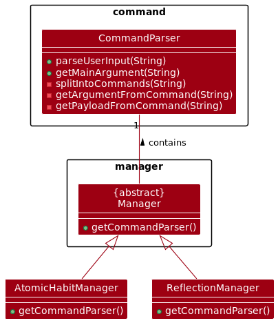  

`CommandParser` integrates into the boilerplate via the abstract Manager class.  
All features are controlled by a manager subclass - hence the developers just need to call
`getCommandParser` to get a reference to the `CommandParser` taking care of all commands
in the `Manager` subclass.

#### CommandParser API

There are only two methods that developers need to know to use `CommandParser`.

1. `parseUserInput`
2. `getMainArgument`

**Usage: `parseUserInput`**

`parseUserInput` is used to get a `HashMap` representation of the user input, a bijection
between `argument` and `payload` pairs.

Implementation of `parseUserInput`:

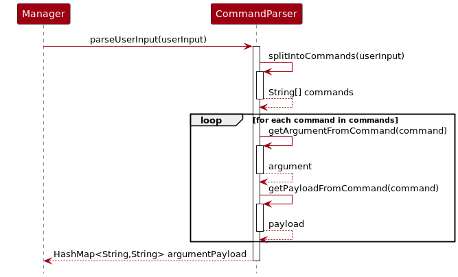

`parseUserInput(String userInput)` is used to directly convert a string into their argument-payload pairs.
It first calls `splitIntoCommand` to split input over the `' --'` delimiter to get a `String[] commands`.
Each `command` in `commands[]` contain the argument and payload. Internally, it splits the
argument from the payload and populates a `HashMap` with the one-to-one mapping. After all `command`s have
been processed, the map is returned to the `Manager` for usage.

**Sample Code**

```java
// Example usage to get the HashMap
public class FooManager extends Manager {
    public HashMap<String, String> handleCommand(String userInput) {
        // Get a reference to the parser
        CommandParser parser = getCommandParser();
        // Get the one-to-one mapping
        HashMap<String, String> result = parseUserInput(userInput);
        return result;
    }
}
```

**Usage: `getMainCommand(userInput)`**

To understand what the user wants to do, we need a convenient way to get the `mainCommand` from the user input.
The canonical way to do this is to use `getMainCommand`. This defeats adversarial input where the main command
is input as an argument.

Internally, this just splits the string by whitespace and returns the first word in the array.

<!-- @@author YongbinWang -->
## AtomicHabit Component

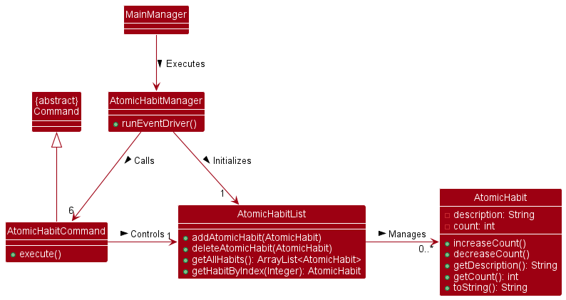
The `AtomicHabit` component is responsible for tracking the user's daily habits.
It consists of the `feature` package and the `command` package.

### Package Layout
The `command` package consists of the `AddCommand`, `DeleteCommand`, `HomeCommand`, `ListCommand`, `UpdateCommand`.

* `AddCommand` - Adds a new habit to the user's habit list.
* `DeleteCommand` - Delete an atomic habit from the user's habit list.
* `HomeCommand` - Returns the user back to main interface.
* `ListCommand` - Lists all the user's habits.
* `UpdateCommand` - Updates the user's habit count.

The `feature` package contains the `AtomicHabit` class, the `AtomicHabitList` class and the `AtomicHabitManager` class.
The `AtomicHabit` class represents a single habit, while the `AtomicHabitList` class represents the list of all the
user's habit and the `AtomicHabitManager` class is the class that manages the `AtomicHabitList` class and executes
the `commands`.

The `AtomicHabitManager` class utilises `TextUi` class to process user inputs and execute the `commands` accordingly.

The `AtomicHabitList` class is implemented as an ArrayList of `AtomicHabit` objects.

The `AtomicHabit` class has the following attributes:

* `description` - the description of the habit
* `count` - the number of times the habit is done

### Implementation of `AtomicHabitManager`
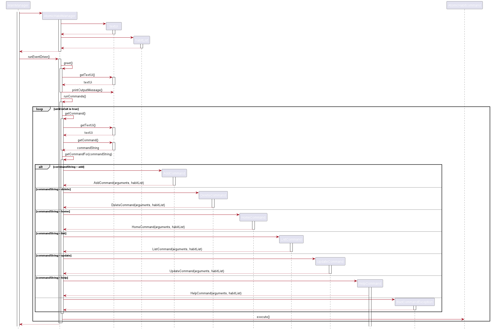
`AtomicHabitManager` is a subclass of `Manager` class. It is initialised by the `MainManager`.
When the user enters 'hb' command, the `MainManager` will call the `runEventDriver()` method of `AtomicHabitManager`
object. The `runEventDriver()` method will call back the `greet()` method to print the welcome message.
Then, it will call the `runCommands()` method to process the user input and execute the `commands` accordingly.
The output of the `commands` will be printed by the `textUi` object which is an attribute of `AtomicHabitManager` class
and is initialised in the constructor. `habitList` which was initialised in the constructor is the `AtomicHabitList`
object that stores all the user's habits.
<!-- @@author -->

<!-- @@author haoyangw -->
## Managers

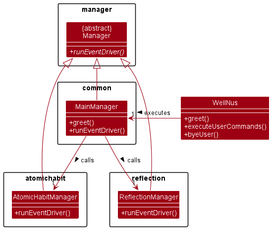<br/>
The `Manager` abstract class is the superclass for classes responsible for handling user interaction with the app.

### Implementation Rationale
Each `Manager` provides `runEventDriver()`, which takes over control of user interaction and provides a particular
feature(along with all its commands). This fulfils the `Single Responsibility Principle` as every `Manager` is in charge
of one particular feature and recognises its feature's commands, so it will only change when the feature
and/or its commands change. This reduces coupling and increases cohesion as changes in one feature will not
cascade and require amendments to other code(e.g. other `Manager`s), and one feature's commands and input are processed
together in one class(a particular implementation of `Manager`). This design further fulfils the `Dependency Inversion
Principle` as the main `WellNus` class doesn't depend on actual implementations of `Manager`, but on the abstract
`Manager` class and its `runEventDriver()` method that all implementations of `Manager` shall provide(with the same
expected functionality). Individual `Manager`s are free to provide additional functionality, but `WellNus` shall not
expect any or depend on them so changes in individual features will not require updating the main `WellNus` class.

In `runEventDriver()`, every `Manager` shall read and process user input using `TextUi` and `CommandParser` and delegate
the issued command to the corresponding `Command` class. This fulfils the `Single Responsibility Principle`, as a
particular implementation of `Manager` is not responsible for providing logic to read user input from the commandline,
nor provide logic for any of the feature's supported commands. Its responsibility is abstract and singular: to recognise
supported commands and call the corresponding `Command` implementation to execute the user's
requested action. This ensures that changes in logic for individual commands or reading of user input will not require
any changes in a particular implementation of `Manager`, as should be expected. A `Manager` class will only change to
recognise new commands for its feature.

### `MainManager`: A Unique Implementation
`MainManager` is a unique implementation of `Manager` in that it holds references to every feature's `Manager` instance.
This is important as `MainManager` then acts as an abstraction barrier for the application: `WellNus` does not know
what features or commands are supported by the application, and only knows that `MainManager` can recognise supported
features and commands within its `runEventDriver()` implementation. As such, the main `WellNus` class can be kept
abstract and simple: call `MainManager.runEventDriver()` to handle user interaction and greet the user. Additionally,
holding references to every feature's `Manager` allows `MainManager` to preserve the entire state of the running
application so that a previous session for a feature can be fully restored when the user returns to it, as though
he/she never left. This makes sense conceptually for a class named `MainManager` and eliminates the need to restore a
particular `Manager`'s state from storage if the application is still running and the user returns to a particular
feature.
<!-- @@author -->

<!-- @@author BernardLesley -->
## Tokenizer

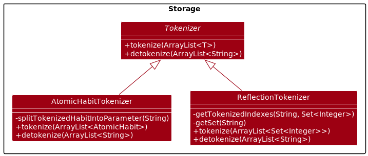<br/>
The `Tokenizer` interface is the superclass for classes responsible for converting data stored temporarily in feature's
Managers into Strings for storage and also convert Strings from storage back into data that can be restored by Managers.

### Implementation Rationale
Each `Tokenizer` provides `tokenize()` and `detokenize()`, which can then be adapted for each feature. This fulfills the
`Single Responsibility Principle` as each `Tokenizer` are only responsible to tokenize and detokenize data from only one
Feature. Furthermore, this design also fulfills `Open-Closed Principle` where `Tokenizer` interface are open for
extension
should there be a new feature added into WellNUS++., while the `Tokenizer` feature itself are closed for modification.
In
addition, this design principle fulfills the `Dependency Inversion Principle` as the feature's Managers are not
dependent on
actual implementation of `Tokenizer`, but on the abstract of `Tokenizer` class and its `tokenize()` and `detokenize()`
method. Each feature's tokenizer are free to implement `tokenize()` and `detokenize()` as every feature might store
different
kinds of data.

### Individual Tokenizers
`AtomicHabitTokenizer` class is responsible to tokenize and detokenize ArrayList of AtomicHabits that
AtomicHabitManager will
use or store. Each habit will be tokenized in the following
format `--description [description of habit] --count [count of
habit]` using the `tokenize()` method. While `detokenize()` method converts the strings back to ArrayList of AtomicHabit
that
can be initialized in AtomicHabitManager to restore the state of the Manager.

`ReflectionTokenizer` class is responsible to tokenize the liked question's index and previous questions's index and
detokenize
it back. ArrayList of Set containing the index of `like` and `pref` will be passed to the `tokenize()` function. The
data will
be stored in the following format

```
like:[index of liked question]
prev:[index of previous question]
``` 

`detokenize()` then can be called by ReflectionManager to retrieve the ArrayList containing the Set of liked and
previous
questions' index to restore its state.
<!-- @@author -->

<!-- @@author nichyjt -->
## Storage

Storage is a common API built to work completely decoupled from any `Tokenizer` implementation.

Saving: `saveData`, `Storage` allows for any tokenizing structure logic as long as the input data is in the form
of an `ArrayList<String>`.

Loading: `loadData` will load all `WellNUS++` data into a common data type, `ArrayList<String>`.

The data transformation from `String` to the target data type by the managers is solely up to `Tokenizer`.

### Usage: `saveData()`

To illustrate the overall flow on how to save data, refer to the sequence diagram below.

The general idea is to `tokenize` it first into the `ArrayList<String>` format calling before
calling `Storage`'s `saveData` method.

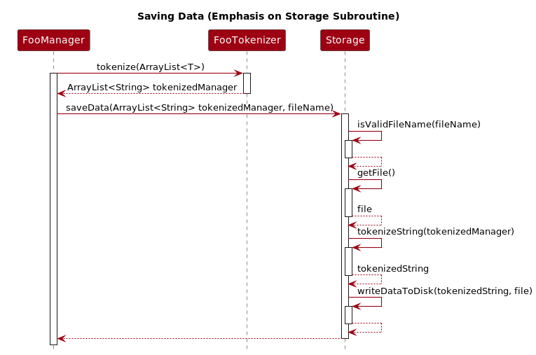

### Design Considerations

- Only filenames defined by public string constants in the `Storage` class.
  This is meant to prevent developer mis-use and control what exactly waht files WellNUS++ can create.
- Internally, each entry in `ArrayList<String>` will be delimited by ` --\n`, where \n is `System.LineSeparator()`.
  This was chosen due to the invariant property of `' --'` in the context of WellNUS++. Due to the way all user input
  is filtered by the `CommandParser`, the chosen delimiter should never show up in any data input, such as a habit name
  from `AtomicHabits`

<!-- @@author nichyjt -->
## Focus Timer Component
The `Focus Timer` component is responsible for tracking the user's daily habits.
It consists of the `feature` package and the `command` package.

It contains commands that you would expect from a timer, such as stopping,
pausing, and more.

### Design Considerations


### Focus Timer Implementation

The focus timer contains a `FocusManager`.
The session is a wrapper for all the `Countdown` and contains utility logic to identify state and manage Countdown.
`Countdown` houses the timer that actually does the counting and holds attributes that help
identify the state of the FocusTimer.

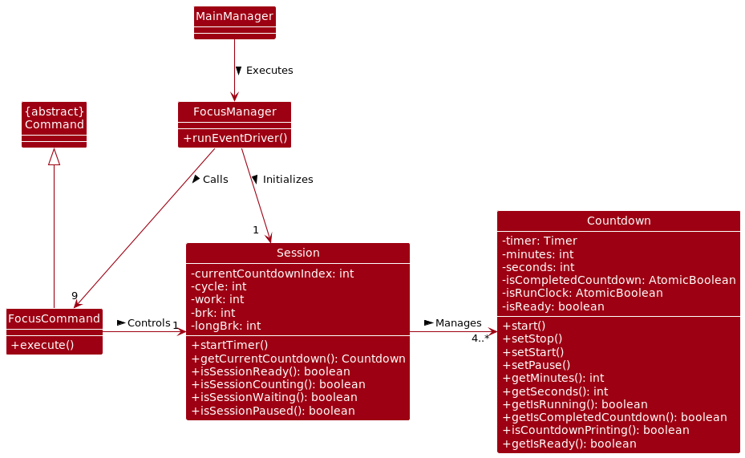

Note: For readability, FocusCommand is an abstraction of all the 9 different commands that exist in FocusTimer.

#### State Management
The timer is an inherently complex feature. There are many commands, and some commands
logically cannot be executed in certain states. For example, if the timer is `Paused`,
the user cannot go to the `next` Countdown.

Problem: It is confusing to developers to check if the `command` that they are writing


To help developers, we define the expected behaviour for focus timer
in this **simplified** finite state machine (FSM) diagram.

The black circle represents the entrypoint into FocusTimer, and
the labels of the arrows are the valid `command`. 
The command `home` has been left out to make the diagram simpler.
It is a command that can be called in any state, and does not add value to it.


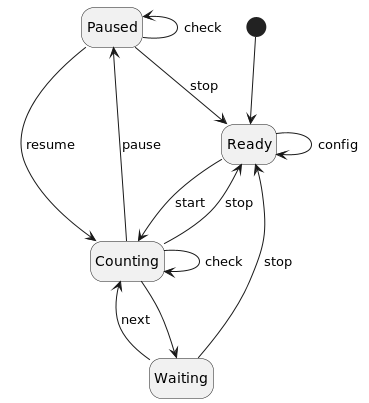


From the diagram and the class diagram, we can derive a truth table
from the attributes of each Countdown and tag them to a state.


| State/Flag | isRunClock | isCompletedCountDown | isReady |  
|------------|------------|----------------------|---------|
| Ready      | X          | X                    | T       |
| Counting   | T          | F                    | F       |
| Waiting    | F          | T                    | F       |
| Paused     | F          | F                    | F       |
Truth table, where X denotes a 'dont care' condition
where the truth value does not matter.

From this, we can easily check which state we are in and then allow exe
Referring to the class diagram, this is implemented on `Session` with various methods helping identify the state:  

Example implementation:
```
public boolean isSessionCounting(){
    Countdown countdown = getCurrentCountdown();
    return countdown.getIsRunning() && !countdown.getIsCompletedCountdown();
}
```

Developers can easily check if a command is in a valid state to be executed by using these
methods in `Session` to check which state the command is being called in. 
- `isSessionReady()`
- `isSessionCounting()`
- `isSessionWaiting()`
- `isSessionPaused()`
<!-- @@author -->

<!-- @@author YongbinWang -->
#### Commands

## Product scope

### Target user profile

* NUS Computing and Engineering students
* Spend lots of time coding on their IDE and type relatively fast
* Have to regularly use digital gadgets and Internet for their courses
* Very familiar with command line interfaces
* Stressed about academy and many others
* Busy with work and drowning in deadlines
* Wants to improve their wellness
* Sometimes unmotivated with short attention span

### Value proposition

NUS Computing and Engineering students are often busy with work and sometimes will neglect their wellness. This app aims
to help NUS Computing and Engineering students improve their overall wellness by encouraging the **cultivation of
meaningful
atomic habits**, **practice of self reflection** and **usage of offline timer to stay focused**. By using this app,
we hope users will be more aware of the healthiness of their daily life and take actions to improve their wellness.<br>
<br>
WellNUS++ is a CLI app, primarily due to the following reasons:

* Computing students generally type fast and prefer typing to mouse due to their daily coding routines.
* Due to the data heavy nature and personalised user input of this app, typing will be preferred to clicking.
* In particular, our application is built to reduce context switching. Users can launch the application from the comfort
  of their favourite IDE’s terminal to reduce disruption to their daily coding lives.
* Instead of using electronics with fancy GUI, this CLI app gives computing students an opportunity to minimise digital
  interaction which will be beneficial for their wellness.
* The app is gamified to make it more attractive for students to use. Levels and micro-goals incentivise our
  users to keep using the app’s features, allowing them to focus on their work and achieve wellness.

## User Stories

| Version | As a ...                                           | I want to ...                                               | So that I can ...                                  |
|---------|----------------------------------------------------|-------------------------------------------------------------|----------------------------------------------------|
| v1.0    | Computing student who prefers typing over clicking | I can use keyboard instead of mouse                         | I can use the app efficiently                      |
| v1.0    | Computing student who is too used to the Internet  | Reduce my browsing and information overload                 | I can improve my attention span                    |
| v1.0    | Reflective student                                 | I can get one introspective question on-demand              | I can reflect and grow emotionally at my own pace  |
| v1.0    | Computing student who wishes to improve lifestyle  | I can add an atomic habit to track                          | I can start the process of inculcating a new habit |
| v1.0    | Computing student who wishes to improve lifestyle  | I can view all my atomic habits                             | I can keep track of my self-improvement progress   |
| v1.0    | Computing student who wishes to improve lifestyle  | I can update my atomic habits                               | I can adjust the habits based on my progress       |
| v2.0    | Reflective student                                 | I can mark introspective questions that I resonate with     | I can reflect using my favourite questions         |
| v2.0    | Reflective student                                 | I can get the previous questions I viewed                   | I can re-view these questions                      |
| v2.0    | Easily distracted computing student                | I want to start a timer to keep track of time spent on work | I can do timed-practice                            |
| v2.0    | Easily distracted computing student                | I want to check the time                                    | I can keep track of my pace                        |
| v2.0    | A regular WellNUS++ user                           | I wish to have my information stored in the app             | I can re-view my past data                         |

## Non-Functional Requirements

1. Should work on any mainstream OS as long as it has Java 11 or above installed.
2. A user with above average typing speed for regular English text (i.e. not code, not system admin commands) should
   be able to accomplish most of the tasks faster using commands than using the mouse.

## Glossary

* *glossary item* - Definition
* **Mainstream OS**: Windows, Linux, Unix, OS-X
* **Main Command**: The first WORD that a user types in. `e.g. reflect, exit`
* **Argument**: A word that is a parameter to a `Main Command` and is prefixed by ` --`. `e.g. --id, --name`
* **Payload**: An (optional) arbitrary sequence of characters immediately following a main command or argument.
  The payload will terminate when the user clicks `enter` or separates the payload with another argument
  with the `--` delimiter.

## Instructions for manual testing

### Launch

1. Ensure you have Java 11 or above installed in your Computer.
2. Download the latest `wellnus.jar` from here.
3. Copy the file to the folder you want to use as the home folder for your WellNUS++.
4. Open a command terminal, cd into the folder you put the `wellnus.jar` file in, and use the `java -jar wellnus.jar`
   command to run the application. A CLI should appear in a few seconds.

### Sample test cases

<!-- @@author wenxin-c -->
#### Help command

1. Make sure you are in the main interface, but individual features(i.e. hb, reflect and timer)
2. Test case: `help`<br>
   Expected output: a list of commands with their usage
   Example:

```
------------------------------------------------------------
    We are here to ensure your wellness is taken care of through WellNUS++
Here are all the commands available for you!
------------------------------------------------------------
------------------------------------------------------------
    1. hb - Enter Atomic Habits: Track your small daily habits and nurture it to form a larger behaviour
    usage: hb
    2. reflect - Read through introspective questions for your reflection
    usage: reflect
    3. exit - Exit WellNUS++
    usage: exit
------------------------------------------------------------
```

3. Test case: `help me`<br>
   Expected output: the list of commands will not be generated as it is an invalid command<br>
   Example:

```
------------------------------------------------------------
    help does not take in any arguments!
------------------------------------------------------------
```

4. To get a list of available commands, any command other than `help` is invalid

#### Get reflection questions

1. Make sure you are inside **Self Reflection** feature by enter `reflect` command after the launch of the program
2. Test case: `get`<br>
   Expected output: get a set of 5 random introspective questions<br>
   Example:

```
============================================================
    1.What is my purpose in life?
    2.What is my personality type?
    3.Did I make time for myself this week?
    4.What scares me the most right now?
    5.When is the last time I gave back to others?
============================================================
```

3. Test case: `get reflect`<br>
   Expected output: introspective questions will not be generated as this is an invalid command. <br>
   Example:

```
!!!!!!-------!!!!!--------!!!!!!!------!!!!!---------!!!!!!!
Error Message:
    Command is invalid.
Note:
    Please check the available commands and the format of commands.
!!!!!!-------!!!!!--------!!!!!!!------!!!!!---------!!!!!!!
```

4. Any command other than `get` is invalid

#### Add atomic habits

1. Make sure you are inside **Atomic habit** feature by enter `hb` command after the launch of the program
2. Test case: `add --name make bed every morning`<br>
   Expected output: a new atomic habit is successfully added<br>
   Example:

```
------------------------------------------------------------
    Yay! You have added a new habit:
    'make bed every morning' was successfully added
------------------------------------------------------------
```

3. Test case: `add name make bed every morning`<br>
   Expected output: the atomic habit will not be added in as this is an invalid command<br>
   Example:

```
!!!!!!-------!!!!!--------!!!!!!!------!!!!!---------!!!!!!!
Error Message:
    Wrong arguments given to 'add'!
Note:
    
!!!!!!-------!!!!!--------!!!!!!!------!!!!!---------!!!!!!!
```

4. Any commands that does not follow the format of `add --name ATOMIC_HABIT_NAME` is invalid
<!-- @@author -->

<!-- @@author haoyangw -->
### Saving data
1. Dealing with missing data files
* Ensure data files are created: Add a new atomic habit using the `add --name Test data file` command in the `hb`
  session
* Quit `WellNUS++`: Issue `home` command in the `hb` session followed by `exit` command in the `main` session
* Delete data files: Delete the `data` folder created in the same folder as the `WellNUS++` jar file you just executed
* Relaunch `WellNUS++`: Run the `WellNUS++` jar file, issue `hb` command and then issue `list` command. Verify that no
  atomic habits are now recorded, i.e. `WellNUS++` should output:
```
~~~~~~~~~~~~~~~~~~~~~~~~~~~~~~~~~~~~~~~~~~~~~~~~~~~~~~~~~~~~
    You have no habits in your list!
    Start adding some habits by using 'add'!
~~~~~~~~~~~~~~~~~~~~~~~~~~~~~~~~~~~~~~~~~~~~~~~~~~~~~~~~~~~~
```
2. Dealing with corrupted data files
* Quit `WellNUS++`
* Open the `data/habit.txt` file located in the same directory as the `WellNUS++` jar file
* Replace the contents of the `habit.txt` file with the following lines:
```
--description Valid atomic habit --count 1 --
--corrupted Data --test to be ignored --
```
* Run the `WellNUS++` jar file
* View the saved atomic habits: Issue `hb` followed by `list`. Expected output should be:
```
~~~~~~~~~~~~~~~~~~~~~~~~~~~~~~~~~~~~~~~~~~~~~~~~~~~~~~~~~~~~
    You have no habits in your list!
    Start adding some habits by using 'add'!
~~~~~~~~~~~~~~~~~~~~~~~~~~~~~~~~~~~~~~~~~~~~~~~~~~~~~~~~~~~~
```
* Explanation: Upon relaunch, `WellNUS++` detected the invalid line `--corrupted Data --test to be ignored --` and
  cleaned the contents of the data file, leaving no atomic habits recorded
<!-- @@author -->