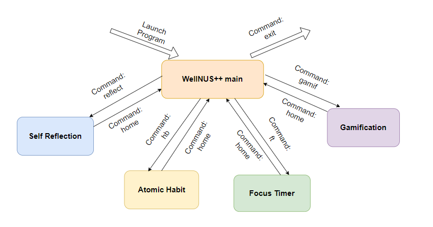

# WellNUS++ User Guide

```
,--.   ,--.       ,--.,--.,--.  ,--.,--. ,--. ,---.     |  |        |  |     
|  |   |  | ,---. |  ||  ||  ,'.|  ||  | |  |'   .-',---|  |---.,---|  |---. 
|  |.'.|  || .-. :|  ||  ||  |' '  ||  | |  |`.  `-.'---|  |---''---|  |---' 
|   ,'.   |\\  --.|  ||  ||  | `   |'  '-'  '.-'    |   |  |        |  |     
'--'   '--' `----'`--'`--'`--'  `--' `-----' `-----'    `--'        `--'     
```

## Introduction

WellNUS++ is a Command Line Interface(CLI) app for NUS Computing students to keep track and improve their physical and
mental wellness in various aspects. If you can type fast, WellNUS++ can update their wellness progress faster than
traditional Graphical User Interface(GUI) apps.

## Table of Contents

<!-- TOC -->
* [WellNUS++ User Guide](#wellnus-user-guide)
  * [Introduction](#introduction)
  * [Table of Contents](#table-of-contents)
  * [Quick Start](#quick-start)
  * [Overview of WellNUS++](#overview-of-wellnus)
  * [Features](#features)
    * [Command Format](#command-format)
    * [Viewing WellNUS++ help: help](#viewing-wellnus-help--help)
    * [Accessing feature: FEATURE_NAME](#accessing-feature--featurename)
    * [hb: Accessing atomic habit feature](#hb--accessing-atomic-habit-feature)
    * [add: Add new atomic habit](#add--add-new-atomic-habit)
    * [list: List all atomic habit](#list--list-all-atomic-habit)
    * [update:  Update an atomic habit](#update--update-an-atomic-habit)
    * [delete: Delete an atomic habit](#delete--delete-an-atomic-habit)
    * [help: Viewing Atomic Habit Help](#help--viewing-atomic-habit-help)
    * [gamif: Accessing gamification feature](#gamif--accessing-gamification-feature)
    * [stats: Gamification statistics](#stats--gamification-statistics)
    * [help: Viewing Gamification Help](#help--viewing-gamification-help)
    * [reflect: Accessing self reflection feature](#reflect--accessing-self-reflection-feature)
    * [get: Get reflection questions](#get--get-reflection-questions)
    * [like: Add reflection question into favorite list](#like--add-reflection-question-into-favorite-list)
    * [fav: View favorite list](#fav--view-favorite-list)
    * [unlike: Remove questions from favorite list](#unlike--remove-questions-from-favorite-list)
    * [prev: Get the previous set of reflection questions generated](#prev--get-the-previous-set-of-reflection-questions-generated)
    * [help: Viewing Reflection Help](#help--viewing-reflection-help)
    * [ft: Accessing Focus Timer Feature](#ft--accessing-focus-timer-feature)
    * [start: Start Session](#start--start-session)
    * [pause: Pause session](#pause--pause-session)
    * [resume: Resume session](#resume--resume-session)
    * [check: Check time](#check--check-time)
    * [next: Next timer](#next--next-timer)
    * [stop: Stop session](#stop--stop-session)
    * [help: Viewing Focus Timer help](#help--viewing-focus-timer-help)
    * [config: Configure the Timer](#config--configure-the-timer)
    * [home: Return back main WellNUS++](#home--return-back-main-wellnus)
    * [exit: Exit WellNUS++](#exit--exit-wellnus)
  * [FAQ](#faq)
  * [Command Summary](#command-summary)
<!-- TOC -->

## Quick Start

1. Ensure you have Java 11 or above installed in your Computer.

2. Download the latest CS2113_T12_4_WellNUS.jar
   from [here](https://github.com/AY2223S2-CS2113-T12-4/tp/releases/latest).

3. Copy the file to the folder you want to use as the home folder for your WellNUS++.

4. Open a command terminal, cd into the folder you put the .jar file in, and use
   the `java -jar CS2113-T12-4-WellNUS.jar`
   command to run the application. A CLI should appear in a few seconds (shown below).

```
------------------------------------------------------------
    Very good day to you! Welcome to
    
    ,--.   ,--.       ,--.,--.,--.  ,--.,--. ,--. ,---.     |  |        |  |
    |  |   |  | ,---. |  ||  ||  ,'.|  ||  | |  |'   .-',---|  |---.,---|  |---.
    |  |.'.|  || .-. :|  ||  ||  |' '  ||  | |  |`.  `-.'---|  |---''---|  |---'
    |   ,'.   |\   --.|  ||  ||  | `   |'  '-'  '.-'    |   |  |        |  |
    '--'   '--' `----'`--'`--'`--'  `--' `-----' `-----'    `--'        `--'
------------------------------------------------------------
------------------------------------------------------------
    Enter a command to start using WellNUS++! Try 'help' if you're new, or just unsure.
------------------------------------------------------------
```

## Overview of WellNUS++

WellNUS++ comes with a variety of features to help you enhance your overall wellness in NUS! The features are Atomic
Habit, Self Reflection, Focus Timer and Gamification. Each feature has its own set of commands for users to explore.
Users can navigate to different features from main WellNUS++ and return from each feature back to main
WellNUS++ using `home` command. Do note that users can only `exit` the program from main WellNUS++.



## Features

### Command Format

* Words in UPPER_CASE are the parameters to be supplied by the user
  e.g. in add --name NAME is a parameter which can be used as add --name John Doe
* Items in square brackets are optional.
  E.g --name NAME  [--tag TAG] can be used as --name John Doe --tag friend or as --name John Doe

* Items with … after them can be used multiple times including zero times.
  e.g. [--tag TAG]… can be used as   (i.e. 0 times), --tag friend, --tag friend, --tag family etc

* Parameters can be in any order.
  e.g. if the command specifies --name NAME --phone PHONE_NUMBER, --phone PHONE_NUMBER --name NAME is also acceptable

<!-- @@author BernardLesley -->

### Viewing WellNUS++ help: help

Lists all commands available and provide a short description of the application.

Format: `help [COMMAND_TO_CHECK]`

* List all commands available in the app and a short description of the app
* Give a detailed explanation of the parameters and subcommands for a given command

Example of usage 1:

`help`

Expected outcome:

```
------------------------------------------------------------
    WellNUS++ is a Command Line Interface (CLI) app for you to keep track, manage and improve your physical and mental wellness.
    Input `help` to see all available commands.
Input `help [command-to-check]` to get usage help for a specific command.
Here are all the commands available for you!
    
    1. Atomic Habits (hb) - Track and manage your habits with our suite of tools to help you grow and nurture a better you!
    2. Reflection (reflect) - Take some time to pause and reflect with our specially curated list of questions and reflection management tools.
    3. Focus Timer (ft) - Set a configurable timer with work and rest cycles to keep yourself focused and productive!
    4. Gamification (gamif) - Gamification gives you the motivation to continue improving your wellness by rewarding you for your efforts!
    5. exit - Close WellNUS++ and return to your terminal.
    6. help - Get help on what commands can be used in WellNUS++.
------------------------------------------------------------
```

Example of usage 2:

`help hb`

Expected outcome:

```
------------------------------------------------------------
    Atomic Habits (hb) - Track and manage your habits with our suite of tools to help you grow and nurture a better you!
    usage: hb
------------------------------------------------------------
```

<!-- @@author wenxin-c -->

### Accessing feature: FEATURE_NAME

Access specific feature from main interface by inputting the feature_name. <br>

Feature name can be referenced by calling the help command.

Take note that users are only allowed to access features (i.e. atomic habit, self reflection,
focus timer from the main WellNUS++, cross feature transition is **not
allowed**).

Format: `FEATURE_NAME`

* Accesses unique features to utilise their respective actions

Example of usage:

`reflect`

Expected outcome:

```
============================================================
  #####                       ######                                           
 #     # ###### #      ###### #     # ###### ###### #      ######  ####  ##### 
 #       #      #      #      #     # #      #      #      #      #    #   #   
  #####  #####  #      #####  ######  #####  #####  #      #####  #        #   
       # #      #      #      #   #   #      #      #      #      #        #   
 #     # #      #      #      #    #  #      #      #      #      #    #   #   
  #####  ###### ###### #      #     # ###### #      ###### ######  ####    #   
============================================================
    Welcome to WellNUS++ Self Reflection section :D
    Feel very occupied and cannot find time to self reflect?
    No worries, this section will give you the opportunity to reflect and improve on yourself!!
============================================================
```

<!-- @@author YongbinWang -->

### hb: Accessing atomic habit feature

Atomic habit feature allows users to keep track of the daily habits they wish to develop for better self improvement.

Format: `hb`<br>

Example of usage:<br>

`hb`

Expected outcome:

```
------------------------------------------------------------
    Welcome to the atomic habits feature!
   _    _                _       _  _        _     _  _       
  /_\  | |_  ___  _ __  (_) __  | || | __ _ | |__ (_)| |_  ___
 / _ \ |  _|/ _ \| '  \ | |/ _| | __ |/ _` || '_ \| ||  _|(_-<
/_/ \_\ \__|\___/|_|_|_||_|\__| |_||_|\__,_||_.__/|_| \__|/__/
------------------------------------------------------------
```

### add: Add new atomic habit

Adds an atomic habit to be tracked by WellNUS++ when accessing atomic habit feature.

Format: `add --name ATOMIC_HABIT_NAME `

* ATOMIC_HABIT_NAME is used to uniquely identify each habit(unique and not null)

Example of usage:

`add --name make bed every morning`

Expected outcome:

```
------------------------------------------------------------
    Yay! You have added a new habit:
    'make bed every morning' was successfully added
------------------------------------------------------------
```

### list: List all atomic habit

Shows a list of all atomic habits.

Format: `list`

Example of usage:

`list`

Expected outcome:

```
—-------------------------------------------------------------
Here is the current accumulation of your atomic habits!
Keep up the good work and you will develop a helpful habit in no time
1.Make Bed every morning [1]
2.Read for at least 30 minutes every day [3]
3.Avoid checking phone for the first hour after waking up [2]
... 
—--------------------------------------------------------------- 
```

### update:  Update an atomic habit

Increment the number of times that an atomic habit has been carried out. <br>
Decrement the atomic habits if you wrongly incremented.

Format:

* Step 1: You are recommended to list the current habits using command
* `list`
* Step 2: Select the habit to update by entering the index number of the habit HABIT_INDEX according to index of the
  list output. <br>
  The user can specify the number to change for the habit count via NUMBER_TO_CHANGE. <br>
  The default behaviour is to increment the behaviour by 1. <br> To decrement the habit count, enter a negative number
  instead.
* `update --id HABIT-INDEX [--by NUMBER_TO_CHANGE]`

Example of usage 1:

* `list`
* `update --id 1 --by 2`

Expected outcome 1:

```
—---------------------------------------------------------------
    Here is the current accumulation of your atomic habits!
    Keep up the good work and you will develop a helpful habit in no time
    1. Make bed every morning [5]
    2. Read for at least 30 minutes every day [3] 
—---------------------------------------------------------------
```

```
—---------------------------------------------------------------
    The following habit has been incremented! Keep up the good work!
    1. Make bed every morning [7]
—---------------------------------------------------------------
```

Example of usage 2:

* `list`
* `update --id 1 --by -2`

Expected outcome 2:

```
------------------------------------------------------------
    Here is the current accumulation of your atomic habits!
    Keep up the good work and you will develop a helpful habit in no time
    1.Make bed every morning [7]
    2.Read for at least 30 minutes every day [3]
------------------------------------------------------------
```

```
------------------------------------------------------------
    The following habit has been incremented! Keep up the good work!
    1.Make bed every morning [5]
------------------------------------------------------------
```

<!-- @@author BernardLesley -->

### delete: Delete an atomic habit

Delete an atomic habit that is not relevant anymore.

Format:

* Step 1: List the current habits using command
* `list`
* Step 2: Select the habit to delete by entering the index number of the habit HABIT_INDEX according to index of the
  list output
    * `delete --id HABIT-INDEX`

Example of usage:

* `list`
* `delete --id 1`

Expected outcome:

```
—---------------------------------------------------------------
Here is the current accumulation of your atomic habits!
Keep up the good work and you will develop a helpful habit in no time
1. Make bed every morning [5]
2. Read for at least 30 minutes every day [3] 
—---------------------------------------------------------------
```

```
—---------------------------------------------------------------
The following habit has been deleted:
Make bed every morning [5] has been successfully deleted
—---------------------------------------------------------------
```

<!-- @@author BernardLesley -->

### help: Viewing Atomic Habit Help

Lists all commands available and provide a short description of Atomic Habit feature.

Format: `help [COMMAND_TO_CHECK]`

* List all commands available in the Atomic Habit and a short description of the Atomic Habit
* Give a detailed explanation of the parameters and subcommands for a given command

Example of usage 1:

`help`

Expected outcome:

```
------------------------------------------------------------
    Atomic Habits (hb) - Track and manage your habits with our suite of tools to help you grow and nurture a better you!
    Input `help` to see all available commands.
Input `help [command-to-check] to get usage help for a specific command.
Here are all the commands available for you!
    
    1. add - Add a habit to your habit tracker.
    2. help - Get help on what commands can be used in Atomic Habit WellNUS++
    3. home - Return back to the main menu of WellNUS++.
    4. list - Lists out all the habits in your tracker.
    5. update - Update how many times you've done a habit.
------------------------------------------------------------
```

Example of usage 2:

`help add`

Expected outcome:

```
------------------------------------------------------------
    add - Add a habit to your habit tracker.
    usage: add --name (your habit name)
------------------------------------------------------------
```

<!-- @@author haoyangw -->

### gamif: Accessing gamification feature

Format: `gamif`

Gamification system integrated into WellNUS++ to incentivize users to improve
their wellness.

Users can accumulate XP points from working on their atomic habits and
level up.

Example of usage:

`gamif`

Expected outcome:

```
######################################################################
    Welcome to
    ______                _ _____            __  _           
   / ____/___ _____ ___  (_) __(_)________ _/ /_(_)___  ____ 
  / / __/ __ `/ __ `__ \/ / /_/ / ___/ __ `/ __/ / __ \/ __ \
 / /_/ / /_/ / / / / / / / __/ / /__/ /_/ / /_/ / /_/ / / / /
 \____/\__,_/_/ /_/ /_/_/_/ /_/\___/\__,_/\__/_/\____/_/ /_/ 
######################################################################
```

### stats: Gamification statistics

Displays the user's current XP points and level.

Format: `stats`

Example of usage:

`stats`

Expected outcome:

```
######################################################################
#                 Current XP: Level 2 [===>        ]                 #
#                        7 more XP to Level 3                        #
######################################################################
```

<!-- @@author BernardLesley -->

### help: Viewing Gamification Help

Lists all commands available and provide a short description of Gamification feature.

Format: `help [COMMAND_TO_CHECK]`

* List all commands available in the Gamification and a short description of the Gamification
* Give a detailed explanation of the parameters and subcommands for a given command

Example of usage 1:

`help`

Expected outcome:

```
------------------------------------------------------------
    Gamification (gamif) - Gamification gives you the motivation to continue improving your wellness by rewarding you for your efforts!
    Input `help` to see all available commands.
Input `help [command-to-check]` to get usage help for a specific command.
Here are all the commands available for you!
    
    1. help - Get help on what commands can be used in WellNUS++ Gamification Feature
    2. home - Returns the user to the main WellNus++ session
    3. stats - Displays the user's XP level and points
------------------------------------------------------------
```

Example of usage 2:

`help stats`

Expected outcome:

```
------------------------------------------------------------
    stats - Displays the user's XP level and points
    usage: stats
------------------------------------------------------------
```

<!-- @@author wenxin-c -->

### reflect: Accessing self reflection feature

Format: `reflect`

Self reflection feature allows users to get sets of random introspective questions to reflect on to improve overall
wellness and achieve better selves.

Example of usage:

`reflect`

Expected outcome:

```
============================================================
  #####                       ######                                           
 #     # ###### #      ###### #     # ###### ###### #      ######  ####  ##### 
 #       #      #      #      #     # #      #      #      #      #    #   #   
  #####  #####  #      #####  ######  #####  #####  #      #####  #        #   
       # #      #      #      #   #   #      #      #      #      #        #   
 #     # #      #      #      #    #  #      #      #      #      #    #   #   
  #####  ###### ###### #      #     # ###### #      ###### ######  ####    #   
============================================================
    Welcome to WellNUS++ Self Reflection section :D
    Feel very occupied and cannot find time to self reflect?
    No worries, this section will give you the opportunity to reflect and improve on yourself!!
============================================================
```

<!-- @@author YongbinWang -->

### get: Get reflection questions

Ask WellNUS++ to get a set of 5 random introspective questions for users to view and reflect on.
The questions are randomised for users to reflect on different aspects of life.

Format: `get`

Example of usage:

`get`

Expected outcome:

```
============================================================
    1.What are three of my most cherished personal values?
    2.What is my purpose in life?
    3.What scares me the most right now?
    4.What is something that brings me joy?
    5.When is the last time I gave back to others?
============================================================
```

<!-- @@author wenxin-c -->

### like: Add reflection question into favorite list

Users can add the reflection question they like into favorite list and review afterwards.

Format: `like INDEX`

Note that the users are supposed to at least `get` a set of questions or use `prev` command to
review the previous set before liking them, and use the displayed index to choose questions.
Index parameter is limited to integer 1-5 as only 5 questions will be generated in every random set.

Example of usage:

`like 1`

Expected output:

```
============================================================
    You have added question: What is my purpose in life? into favorite list!!
============================================================
```

### fav: View favorite list

Users can review the list of reflection questions they liked.

Format: `fav`

Example of usage:

`fav`

Example output:

```
============================================================
    1.What are three of my most cherished personal values?
    2.What is my purpose in life?
    3.Am I making time for my social life?
============================================================
```

### unlike: Remove questions from favorite list

Users can remove reflection questions from the favorite list.

Format: `unlike 1`

Take note that it is **recommended** to use `fav` command to check the list of questions in the favorite list before
unliking any of them, so that users are aware which question they are removing.

Example of usage step 1:

`fav`

Example output step 1:

```
============================================================
    1.What are three of my most cherished personal values?
    2.What is my purpose in life?
    3.Am I making time for my social life?
============================================================
```

Example of usage step 2:

`unlike 1`

Example output:

```
============================================================
    You have removed question: What are three of my most cherished personal values? from favorite list!!
============================================================
```

### prev: Get the previous set of reflection questions generated

Users can view the previous set of questions generated for review.

Format: `prev`

Note that the users are supposed to at least `get` a set of questions before viewing the previous set.

Example of usage:

`prev`

Example output:

```
============================================================
    1.What is my purpose in life?
    2.What is my personality type?
    3.Did I make time for myself this week?
    4.Am I making time for my social life?
    5.What is something I find inspiring?
============================================================
```

<!-- @@author BernardLesley -->

### help: Viewing Reflection Help

Lists all commands available and provide a short description of Reflection feature.

Format: `help [COMMAND_TO_CHECK]`

* List all commands available in the Reflection and a short description of the Reflection
* Give a detailed explanation of the parameters and subcommands for a given command

Example of usage 1:

`help`

Expected outcome:

```
------------------------------------------------------------
    Reflection (reflect) - Take some time to pause and reflect with our specially curated list of questions and reflection management tools.
    Input `help` to see all available commands.
Input `help [command-to-check] to get usage help for a specific command.
Here are all the commands available for you!
    
    1. fav - Get the list of questions that have been added to the favorite list.
    2. get - Get a list of questions to reflect on.
    3. help - Get help on what commands can be used in Reflection WellNUS++
    4. home - Return back to the main menu of WellNUS++.
    5. like - Add a particular question to favorite list.
    6. unlike - Remove a particular question from favorite list.
    7. prev - Get the previously generated set of questions.
------------------------------------------------------------
```

Example of usage 2:

`help get`

Expected outcome:

```
------------------------------------------------------------
    get - Get a list of questions to reflect on.
    usage: get
------------------------------------------------------------
```

<!--@@author nichyjt-->

### ft: Accessing Focus Timer Feature

Our Focus Timer feature allows users to be productive by setting a configurable work-break timer, inspired by
the [Pomodoro technique](https://en.wikipedia.org/wiki/Pomodoro_Technique).

**Command input is not allowed when timer is counting down the last 10 seconds.**

Format: `ft`<br>

Example of usage:<br>

`ft`

Expected outcome:

```
************************************************************
    Welcome to Focus Timer.
    Start a focus session with `start`, or `config` the session first!
************************************************************
```

<!--@@author YongbinWang-->

### start: Start Session

Ask WellNUS++ to start the focus session consisting of work and break cycles.

`start` can only be used when you first enter Focus, after a session has ended or after a session has been stopped.

Format: `start`

Example of usage:

`start`

Expected outcome:

```
************************************************************
    Your session has started! Please focus on your task.
******************start******************************************
************************************************************
    Task
************************************************************
```

### pause: Pause session

Ask WellNUS++ to pause the focus session which pauses the current countdown timer.

`pause` can only be used when the timer is counting down.

Format: `pause`

Example of usage:

`pause`

Expected outcome:

```
************************************************************
    Timer paused at: 0:54
************************************************************
```

### resume: Resume session

Ask WellNUS++ to resume the focus session which continues the current countdown timer.

`resume` can only be used when the timer has been paused.

Format: `resume`

Example of usage:

`resume`

Expected outcome:

```
************************************************************
    Timer resumed at: 0:54
************************************************************
```

### check: Check time

Ask WellNUS++ to display the current time of the timer for users to check time remaining.

`check` can be used whenever during the ongoing session.

Format: `check`

Example of usage:

`check`

Expected outcome:

```
************************************************************
    Time left: 0:57
************************************************************
```

### next: Next timer

Ask WellNUS++ to start the next work or break iteration of the focus session.

`next` can only be used when a work or break timer has ended, and a prompt to proceed to the next timer is displayed.

Format: `next`

Example of usage:

`next`

Expected outcome(if the next timer is a work timer):

```
************************************************************
    Task
************************************************************
```

Expected outcome(if the next timer is a break timer):

```
************************************************************
    Break
************************************************************
```

### stop: Stop session

Ask WellNUS++ to stop the focus session.

`stop` can only be used when the session has started.

Format: `stop`

Example of usage:

`stop`

Expected outcome:

```
************************************************************
    Your focus session has ended.
To start a new session, `start` it up!
You can also configure the session to your liking with `config`!
************************************************************
```

<!-- @@author BernardLesley -->

### help: Viewing Focus Timer help

Lists all commands available and provide a short description of Focus Timer feature.

Format: `help [COMMAND_TO_CHECK]`

* List all commands available in the Focus Timer and a short description of the Focus Timer
* Give a detailed explanation of the parameters and subcommands for a given command

Example of usage 1:

`help`

Expected outcome:

```
************************************************************
    Focus Timer (ft) - Set a configurable timer with work and rest cycles to keep yourself focused and productive!
    Input `help` to see all available commands.
Input `help [command-to-check]` to get usage help for a specific command.
Here are all the commands available for you!
    
    1. check - Check the time left in the current session.
This can only be used when a countdown is underway!
    2. config - Change the number of cycles and the times of the work, break and long break of your session!
Note that the minimum cycles is 2,
the maximum number of cycles is 5,
the maximum work/break times is 60 minutes,
the minimum work/break times is 1 minute.
This is to ensure your well-being, as higher values might be counter-productive!
    3. help - Get help on what commands can be used in Focus Timer WellNUS++
    4. home - Stop the session and go back to WellNUS++.
    5. next - When a timer ends, move on to the next countdown!
This can only be used when a countdown timer has ended!
    6. pause - Pause the session!Can only be used when a countdown is ticking.
    7. resume - Continue the countdown.
Can only be used when a countdown is paused.
    8. start - Start your focus session!
    9. stop - Stop the session. You will have to `start` your focus session again!
************************************************************

```

Example of usage 2:

`help stop`

Expected outcome:

```
************************************************************
    stop - Stop the session. You will have to `start` your focus session again!
    usage: stop
************************************************************
```

<!--@@author nichyjt-->

### config: Configure the Timer

Configures the focus timer's settings.
The number of work-break cycles, work length and break length can be configured.
When leaving `ft`, the configuration will be reset to the default values.

Format: `config [--cycle numCycle --work workTime --break breakTime --longbreak longBreakTime]`

* At least one of the arguments, `cycle, work, break, longbreak` must be included along with the main `config` command
* `numCycle` is an **integer** that is `>= 2`
* `workTime, breakTime, longBreakTime` is an **integer** that is `>= 1`

The initial default values for Focus Timer:

* `numCycles = 2`
* `workTime = 1`
* `breakTime = 1`
* `longBreakTime = 1`

Example of usage:

`config --cycle 4`

Expected outcome:

```
************************************************************
    Okay, here's your new session details!
    Cycles: 4
    Work: 1 minute
    Break: 1 minute
    Long break: 1 minute
************************************************************
```

Example of usage 2:

`config --longbreak 2 --cycle 4 --work 5`

Expected outcome:

```
************************************************************
    Okay, here's your new session details!
    Cycles: 4
    Work: 5 minutes
    Break: 1 minute
    Long break: 2 minutes
************************************************************
```

<!--@@ author BernardLesley-->

### home: Return back main WellNUS++

To leave the current feature and return back to main interface. Each individual feature (i.e. atomic habit,
self reflection, focus timer and gamification) has this command with customised
output messages.

Format: `home`

Example of usage:

`home`

Expected outcome for atomic habit:

```
—-----------------------------------------------------------
Thank you for using atomic habits. Do not forget about me!
—-----------------------------------------------------------
```

Expected outcome for self reflection:

```
============================================================
    How do you feel after reflecting on yourself?
    Hope you have gotten some takeaways from self reflection, see you again!!
============================================================
```

### exit: Exit WellNUS++

To exit the app, data of the current progress will be saved in data files.

Format: `exit`

Take note that users are only allowed to exit from main WellNUS++ (i.e. users cannot exit the program from other
features like atomic habit).

Example of usage:

`exit`

Expected outcome:

```
------------------------------------------------------------
    Thank you for using WellNUS++! See you again soon Dx
------------------------------------------------------------
```

<!--@@author haoyangw -->

## FAQ

**Q**: Will my data be saved after every update?

**A**: Yes, data will be saved upon updating and restored when the application is relaunched.

**Q**: How can I navigate the program?

**A**: In WellNUS++, type `help` to view the list of feature supported by our app. From within a feature, `help`
explains all commands available within that feature.

**Q**: How do I start the program?

**A**: Please run the JAR file on your local machine. See the [Quick Start](#quick-start) section for details.

**Q**: Where will my data be stored?

**A**: Each feature's data will be stored in a separate text file within the data folder(relative to the jar file).

<!-- @@author nichyjt -->

## Command Summary

* Help `help`
* Access feature`hb`
    * Add habit `add --name make bed`
    * View habit `list`
    * Update habit `list`
      `update --id 1 [--inc 2]`
* Access feature `reflect`
    * Get reflect question `get`
    * Like reflect question `like INDEX`
    * View favorite list `fav`
    * View previous questions `prev`
* Access feature `gamif`
    * Display gamification statistics `stats`
* Access feature `ft`
    * Configure the timer `config [--cycle 2 --work 1 --break 1 --longBreak 1]`
    * Start the timer `start`
    * Pause the timer `pause`
    * Resume the timer `resume`
    * Check the time left `check`
    * Go to the next countdown `next`
    * Stop the timer `stop`
* Return to main interface `home`
* Exit program `exit`
